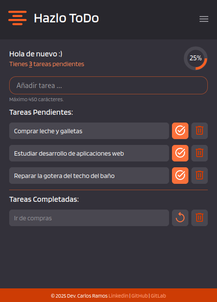

# Lista de Tareas "Hazlo ToDo"

Es una pequeña aplicación web para listar tareas. 

Demo: [https://carlosramos1.github.io/halzo-ToDo/](https://carlosramos1.github.io/hazlo-ToDo/)

Tiene un diseño simple y muy fácil de usar. Consta de cuatro secciones:

- Información resumen de las tareas pendiente y completadas
- Un cuadro para añadir tareas
- Sección de "Tareas pendientes" 
- y por último sección de "Tareas completadas". 

## Las funcionalidades principales

- Añadir tareas máximos hasta 450 caracteres.
- Editar tareas que aun están pendientes.
- Opción de marcar cada tarea como completada.
- Restaurar tareas completadas a la sección de Tareas pendientes.
- Eliminar tareas.
- Circulo que indica el progreso de tareas realizadas.
- Exportar tareas en formato JSON.
- Importar tareas desde un archivo JSON

> Queda pendiente la funcionalidad de recuperar tareas eliminadas.

## Tecnologías utilizadas

El desarrollo de esta aplicación web fue con **HTML, CSS y JavaScript vanilla**. La persistencia de datos (tareas) está en **Local Storage**.

## Developer

Mi nombre es **Carlos Ramos**, soy un desarrollador de software de aplicaciones web.

- Linkedin: https://www.linkedin.com/in/carlosramos05/
- GitHub: https://github.com/carlosramos1
- GitLab: https://gitlab.com/carlosramos14
